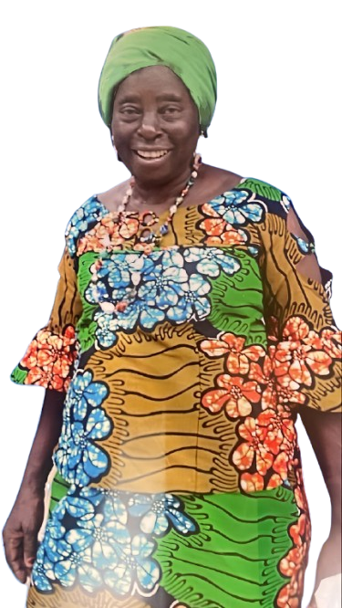

# Obsèque de la matriache TENTCHOU NGUEGNANG ANNE

## Description du Projet
Ce projet vise à honorer et commémorer la mémoire de  la matriache TENTCHOU NGUEGNANG ANNE, en préservant son héritage et son histoire familiale.

## Capture d'écran

## Objectifs
- Documenter la vie et l'héritage de TENTCHOU NGUEGNANG ANNE
- Créer un mémorial numérique
- Permettre aux familles et amis de se souvenir et de partager des souvenirs

## Fonctionnalités
- Biographie détaillée
- Galerie de photos
- Témoignages et hommages
- Informations sur les services funéraires

## Contact
Pour plus d'informations, veuillez contacter la famille.

## Licence
Projet privé - Tous droits réservés